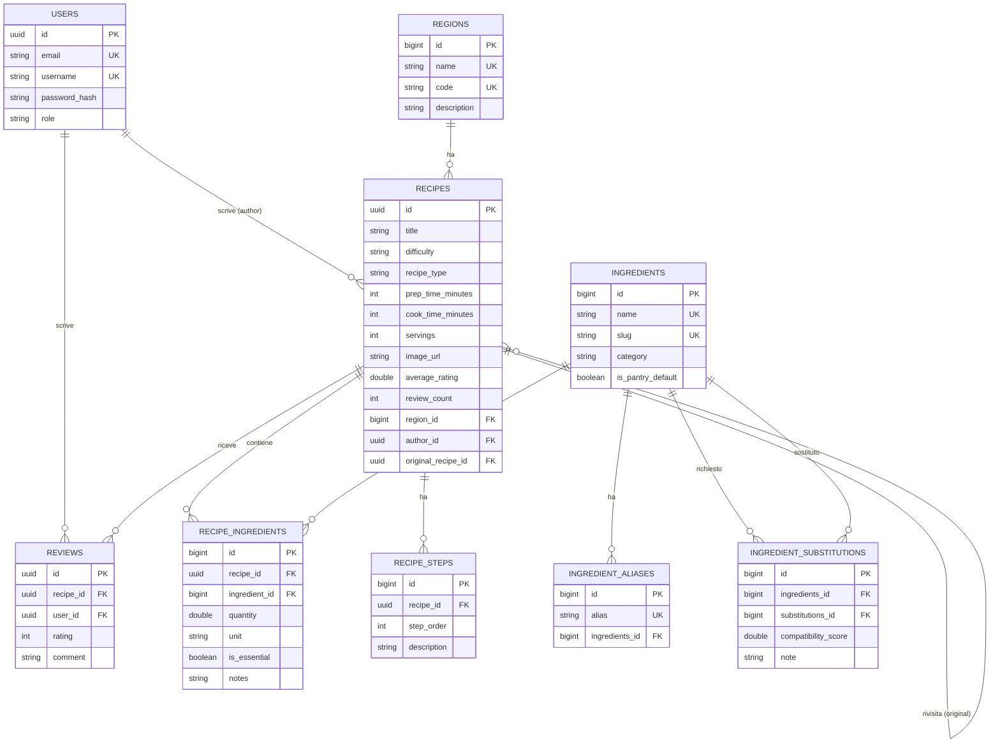

# 🍝 Saporitaly — Backend

API REST della cucina regionale italiana: archivio ricette, **svuotafrigo** (matcher dispensa → ricette con sostituzioni), recensioni e backoffice admin.

**Live demo:** <https://saporitaly-api.example.com>
> 🎨 **[Clicca qui per visualizzare la Repository del Frontend](https://github.com/Lynliash/saporitaly-frontend)**
---

## Stack

Java 25 · Spring Boot 4 · Spring Security + JWT · Spring Data JPA / Hibernate · PostgreSQL · Lombok · Maven

## Cosa fa

- **Archivio** ricette per regione, con ingredienti, passaggi, difficoltà e immagini.
- **Svuotafrigo**: scrivi cosa hai, ti dice cosa puoi cucinare, gestendo i **sostituti** (es. guanciale ↔ pancetta) con un punteggio di affidabilità.
- **Sostituzioni bidirezionali** e **alias** ingredienti (es. "pomodorini" → "Pomodorini ciliegino").
- **Recensioni** con media e conteggio per ricetta.
- **Auth** JWT con ruoli (`BASE` / `ADMIN`) e backoffice admin per CRUD archivio.
- **Seed** automatico al primo avvio: 20 regioni, 60 ricette, ingredienti, alias e sostituzioni.

## Requisiti

- **Java 25**
- **PostgreSQL** in ascolto su `localhost:5432`
- Maven non serve installarlo: c'è il wrapper (`mvnw`)

## Avvio in locale

1. **Crea il database** (vuoto):

   ```sql
   CREATE DATABASE capstone;
   ```

2. **Crea `src/env.properties`** con le tue credenziali:

   ```properties
   DB_URL=jdbc:postgresql://localhost:5432/capstone
   DB_USERNAME=postgres
   DB_PASSWORD=postgres
   JWT_SECRET=una-stringa-lunga-e-casuale-base64
   MAIL_PASSWORD=unused
   ```

3. **Avvia** (porta `8000`):

   ```bash
   ./mvnw spring-boot:run        # Windows: .\mvnw.cmd spring-boot:run
   ```

Al primo avvio (tabella `users` vuota) parte il seed. Per **ricaricarlo** da capo: svuota il database e riavvia.

### Account di test (dal seed)

| Ruolo | Email | Password |
|-------|-------|----------|
| Admin | `admin@saporitaly.it` | `admin123` |
| Base  | `demo@saporitaly.it`  | `password123` |

## Modello dati



## Struttura

```
src/main/java/FrancescoAlves/capstone
├── controllers   # endpoint REST
├── services      # logica (incluso PantryMatcherService, lo svuotafrigo)
├── repositories  # Spring Data JPA
├── entities      # mapping tabelle
├── payloads      # DTO request/response
├── security      # JWT + filtri + config
├── enums · exceptions · config
└── runners       # DataSeederRunner (legge resources/seed-data.json)
```
